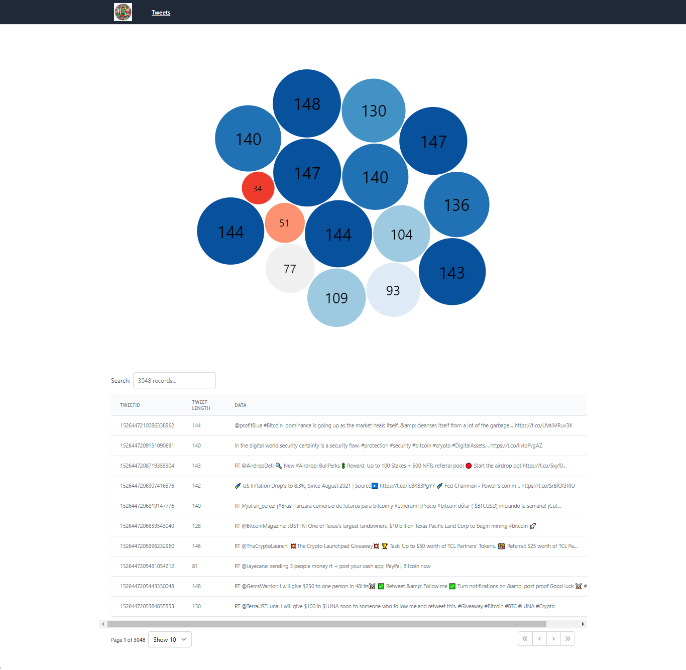

## APP: [https://nestjs-mongo-twitter-stream.herokuapp.com/](https://nestjs-mongo-twitter-stream.herokuapp.com/)

----------------------------------------

# nestjs-mongo-twitter-stream
Tweet listing Web application made up with react v17 (hooks) and react-router v6 and backend with nestjs,  mongodb & socket.io


### Running the WebApp Locally
````
$ git clone https://github.com/mabc224/nestjs-mongo-twitter-stream.git
$ cd nestjs-mongo-twitter-stream

Running Backend
$ cd nestjs-mongo-twitter
Add `.env` file with environment variables for `nestjs-mongo-twitter`. You can check `.env_example` in directory
$ npm install
$ npm run start:dev (watch mode) or npm run start
Then visit `localhost:4000/v0.1/tweets` in your browser.

Running Frontend
$ cd react-twitter-app
Add `.env` file with environment variables for `react-twitter-app`. You can check `.env_example` in directory
$ npm install
$ npm run start
Then visit `localhost:3000` in your browser.
````


### Running the WebApp in Production mode
````
$ git clone https://github.com/mabc224/nestjs-mongo-twitter-stream.git
$ cd nestjs-mongo-twitter-stream

Add `.env` file with environment variables for `nestjs-mongo-twitter` &  `react-twitter-app` directories. You can check `.env_example` inside each directory
Don't forget to set `NODE_ENV=production` inside env files

$ npm run-script start
````
Then visit `localhost:4000` in your browser.

### Video

[](screenshot/video.mp4)

